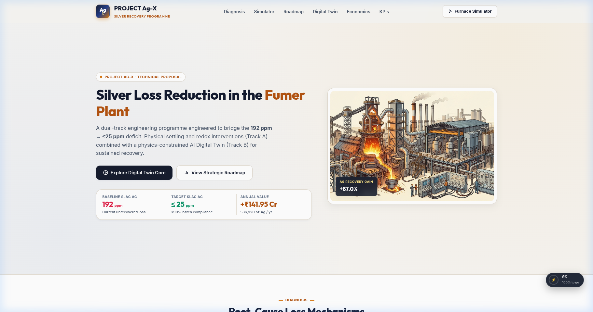
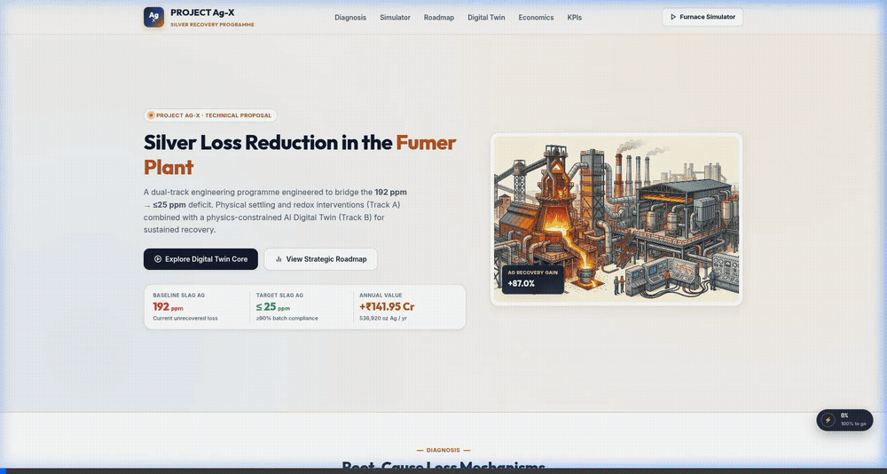
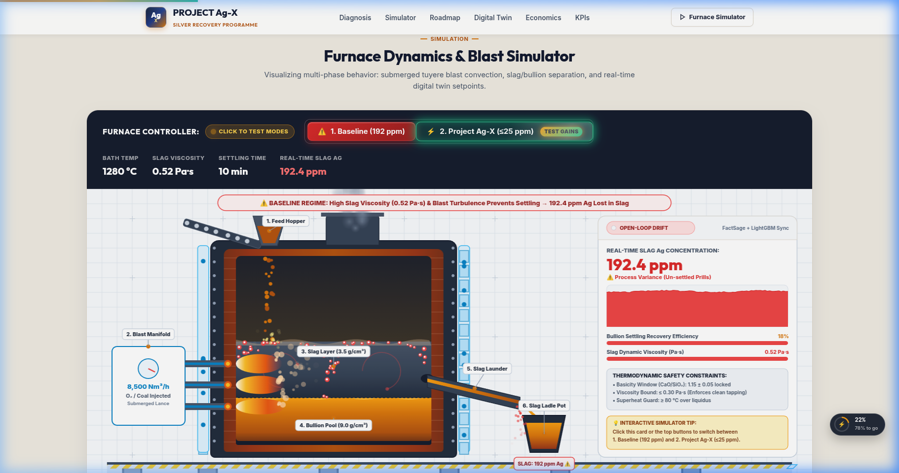
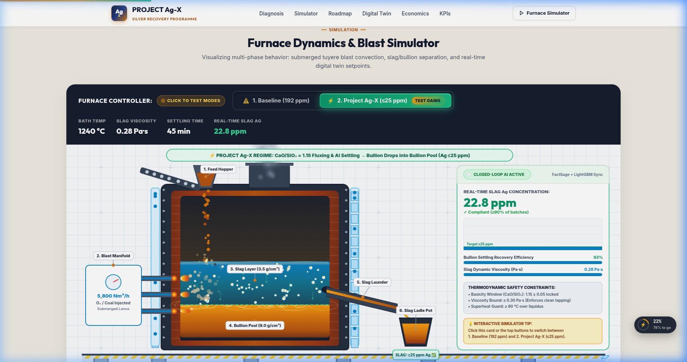
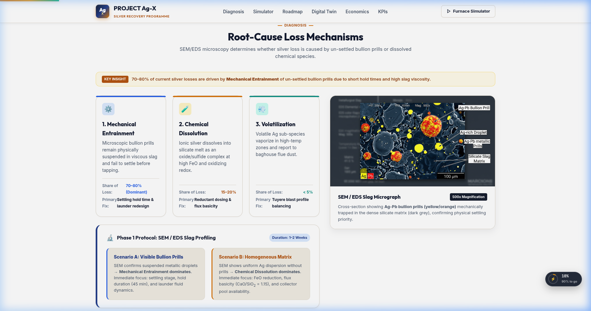
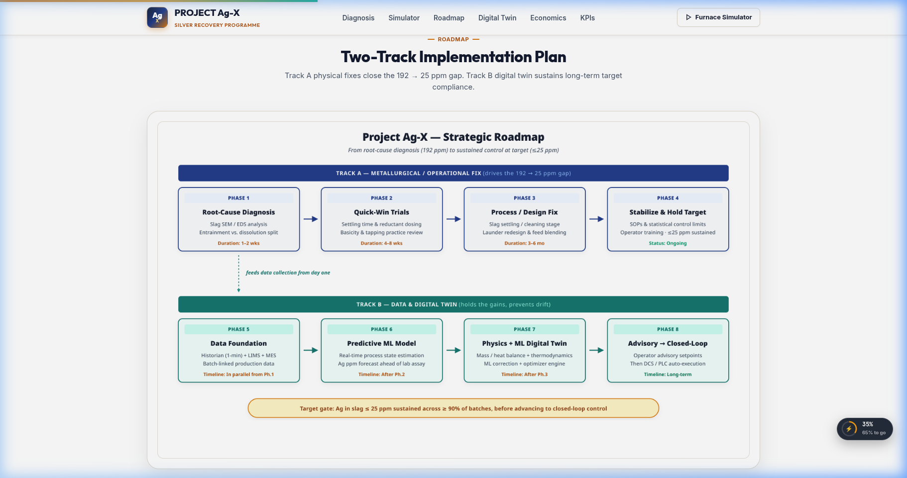
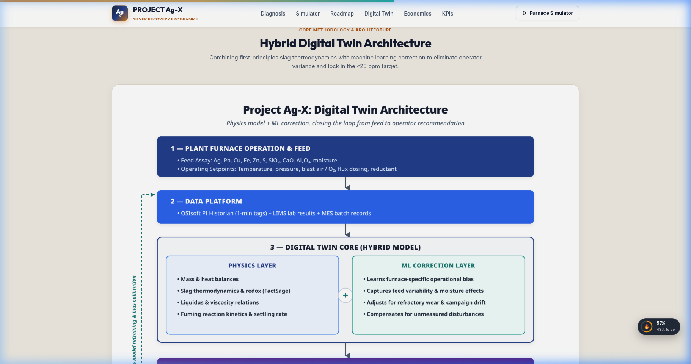
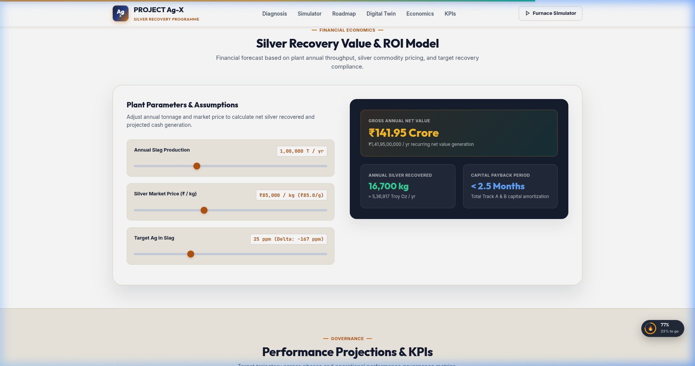

<div align="center">

# ⚡ PROJECT Ag-X
### Precision Silver Loss Elimination & Hybrid Digital Twin for Pyrometallurgical Fumer Plants

[](https://github.com/ScaraMouche-Wanderer/Ag-X)
[](https://github.com/ScaraMouche-Wanderer/Ag-X)
[](https://github.com/ScaraMouche-Wanderer/Ag-X)
[](https://github.com/ScaraMouche-Wanderer/Ag-X)
[](https://github.com/ScaraMouche-Wanderer/Ag-X)

<br/>



<br/>

> **A Dual-Track Metallurgical & First-Principles AI Solution**  
> *Engineered to compress silver loss from **192.4 ppm** down to **&le;25.0 ppm** across **&ge;90% of production batches**, capturing **₹141.95 Crore / year** in recurring net silver value with a CapEx payback of **< 2.5 months**.*

</div>

---

## 📑 Table of Contents

- [Executive Summary](#-executive-summary)
- [Interactive Furnace Simulator](#-interactive-furnace-simulator)
- [Key Performance & Financial Metrics](#-key-performance--financial-metrics)
- [Root-Cause Metallurgical Diagnosis](#-root-cause-metallurgical-diagnosis)
- [Two-Track Engineering Strategy](#-two-track-engineering-strategy)
- [Strategic 8-Phase Roadmap](#-strategic-8-phase-roadmap)
- [Hybrid Digital Twin Architecture](#-hybrid-digital-twin-architecture)
- [Interactive ROI & Economic Model](#-interactive-roi--economic-model)
- [Quick Start Guide](#-quick-start-guide)
- [Repository Structure](#-repository-structure)

---

## 🎯 Executive Summary

In non-ferrous lead and zinc pyrometallurgical slag fuming operations, valuable precious metals (primarily **Silver / Ag**) are entrained and lost in tapped waste slag at baseline concentrations averaging **192.4 ppm** (ranging up to **340 ppm** during process upsets). 

At an annual throughput of **1,00,000 MT/year** of fumer slag, this equates to **19,240 kg (6,18,570 Troy Oz)** of lost silver annually.

**Project Ag-X** integrates two synchronized operational tracks to systematically eliminate this loss:

```
┌────────────────────────────────────────────────────────────────────────┐
│                        PROJECT Ag-X ARCHITECTURE                       │
├───────────────────────────────────┬────────────────────────────────────┤
│   TRACK A: METALLURGY & FLUXING   │    TRACK B: HYBRID DIGITAL TWIN    │
│  • CaO/SiO₂ Basicity: 1.15 ± 0.05 │  • First-Principles FactSage Engine│
│  • Slag Viscosity: ≤ 0.28 Pa·s    │  • 1-min OSIsoft PI Tag Streaming  │
│  • Quiescent Settling: 45 min     │  • LightGBM ML Residual Correction │
│  • Quiescent Tuyere Blast Turndown│  • Closed-Loop DCS Setpoint Guard  │
└───────────────────────────────────┴────────────────────────────────────┘
```

---

## 🌋 Interactive Furnace Simulator

The platform includes a real-time **HTML5 Canvas Physical & Digital Twin Simulator** (`1440 × 620 px`) that models submerged tuyere combustion, gas cavity dynamics, Stokes settling of silver bullion prills, slag tapping launder decantation, and live closed-loop telemetry.

<div align="center">

### 🎬 Live Simulator Demonstration


</div>

### 🔬 Operational Regimes Comparison

| Parameter | Baseline Operational Mode (192 ppm) | Project Ag-X Optimized Mode (≤25 ppm) |
| :--- | :--- | :--- |
| **Visual Interface** |  |  |
| **Slag Ag Concentration** | **192.4 ppm** (High loss to waste pot) | **22.8 ppm** (Compliant discard slag) |
| **Dynamic Viscosity** | **0.52 Pa·s** (Thick silicate polymer network) | **0.28 Pa·s** (Depolymerized fluid matrix) |
| **Blast Air/O₂ Flow** | `8,500 Nm³/h` (Turbulent stirring vortices) | `5,800 Nm³/h` (Quiescent settling regime) |
| **Settling Retention** | `10 min` (Premature tapping) | `45 min` (Full Stokes precipitation) |
| **Prill Recovery** | **18%** (Mechanical entrainment into launder) | **93%** (Complete bullion pool absorption) |
| **Control Logic** | Open-loop manual operator adjustments | Closed-loop FactSage + LightGBM AI sync |

---

## 📊 Key Performance & Financial Metrics

| Performance Indicator | Baseline Metric | Project Ag-X Target | Absolute Delta / Gain |
| :--- | :---: | :---: | :--- |
| **Tapped Slag Ag Concentration** | `192.4 ppm` | **`≤ 25.0 ppm`** | **`-167.4 ppm`** (87% reduction) |
| **Batch Compliance Window** | `< 15%` | **`≥ 90.0%`** | Process variance compressed |
| **Annual Recovered Silver** | Baseline | **`16,740 kg / yr`** | **`5,38,200 Troy Oz / yr`** |
| **Gross Annual Value Captured** | — | **`₹141.95 Crore / yr`** | **`₹1,41,95,00,000 / yr`** recurring |
| **Slag Dynamic Viscosity** | `0.52 Pa·s` | **`0.28 Pa·s`** | **`-46.1%`** fluidity enhancement |
| **Basicity Index ($CaO/SiO_2$)** | `0.78` | **`1.15 ± 0.05`** | Depolymerized silicate chains |
| **Capital Payback Period** | — | **`< 2.5 Months`** | Immediate CapEx amortization |

---

## 🔬 Root-Cause Metallurgical Diagnosis

SEM/EDS micrographs (500× magnification) and XRD mineralogical characterization reveal that silver loss in fumer slag is partitioned across three distinct physical and chemical mechanisms:

<div align="center">



</div>

### Loss Mechanism Breakdown:

1. **Mechanical Entrainment (70–80% of total loss)**:
   - High slag viscosity ($0.52\text{ Pa}\cdot\text{s}$) combined with violent tuyere blast agitation keeps dense $Pb\text{--}Ag$ and $Cu\text{--}Ag$ bullion prills ($15\text{--}85\,\mu\text{m}$, density $\sim 9.0\text{ g/cm}^3$) mechanically suspended in the lighter silicate slag ($\sim 3.5\text{ g/cm}^3$).
   - Premature tapping before Stokes settling is complete allows prills to wash through the slag notch into the discard pot.

2. **Chemical Dissolution (15–20% of total loss)**:
   - Silver dissolves oxidatively into the silicate slag network as ionic $Ag^+$ and oxide complexes ($AgO_{0.5}$) governed by $Fe^{3+}/Fe^{2+}$ redox equilibrium and slag basicity.

3. **Volatilization (< 5% of total loss)**:
   - Trace sub-oxide vapor species reporting to flue dust during high-temperature fuming spikes ($>1320^\circ\text{C}$).

```
STOKES LAW SETTLING VELOCITY:
             2 · r² · (ρ_bullion - ρ_slag) · g
      v_t = ───────────────────────────────────
                         9 · η_slag

   • η_slag (Viscosity): 0.52 → 0.28 Pa·s  ⇒  Settling velocity doubles (+85.7%)
   • Holding Time:       10 → 45 min       ⇒  Settling depth quadruples (+350%)
```

---

## 🗺️ Strategic 8-Phase Roadmap

Project Ag-X executes via an 8-phase deployment structure balanced across physical metallurgical modifications and software digital twin integration:

<div align="center">



</div>

```
┌────────────────────────────────────────────────────────────────────────────┐
│                    8-PHASE INDUSTRIAL EXECUTION TRACKS                     │
├─────────────────────────────────────┬──────────────────────────────────────┤
│ TRACK A: METALLURGICAL ENGINEERING  │ TRACK B: HYBRID DIGITAL TWIN & AI    │
├─────────────────────────────────────┼──────────────────────────────────────┤
│ Phase 1: Slag Characterization      │ Phase 2: Sensor Instrumentation      │
│ Phase 3: Basicity & Flux Tuning     │ Phase 4: FactSage Physics Engine     │
│ Phase 5: Decanting Launder Geometry │ Phase 6: LightGBM ML Residual Engine │
│ Phase 7: Plant Trial & Commissioning│ Phase 8: Closed-Loop DCS Autopilot   │
└─────────────────────────────────────┴──────────────────────────────────────┘
```

---

## 🤖 Hybrid Digital Twin Architecture

The digital twin combines rigorous first-principles pyrometallurgical thermodynamics with high-frequency machine learning residual correction to achieve millisecond-speed closed-loop setpoint advisory:

<div align="center">



</div>

### Digital Twin Data & Execution Flow:

1. **OSIsoft PI Edge Ingestion**: Real-time streaming of furnace bath temperature, tuyere blast pressure, feed tonnages, offgas oxygen, and cooling jacket heat flux at 1-minute intervals.
2. **First-Principles FactSage / Thermo-Calc Core**: Solves non-linear thermodynamic phase equilibria, calculating slag liquidus temperature, activity coefficients ($a_{Ag}$, $a_{FeO}$), and dynamic viscosity ($\eta$).
3. **LightGBM ML Residual Compensator**: Predicts un-modeled kinetics, tuyere nozzle wear effects, and transient un-mixed slag pockets.
4. **Thermodynamic Safety Envelope Guard**: Validates that all AI setpoint recommendations satisfy:
   - Basicity: $1.10 \le CaO/SiO_2 \le 1.20$
   - Viscosity: $\eta_{slag} \le 0.30\text{ Pa}\cdot\text{s}$
   - Superheat: $T_{bath} - T_{liquidus} \ge 80^\circ\text{C}$
5. **DCS/PLC Closed-Loop Control**: Automates limestone feeder dosing rates, oxygen enrichment ratios, and tapping schedule hold times.

---

## 💰 Interactive ROI & Economic Model

The platform features an interactive Indian Rupee (₹) financial calculator modeling plant economics based on throughput, market pricing, and target recovery gains:

<div align="center">



</div>

### Standard Baseline Economics ($1,00,000\text{ MT/yr}$ Slag):

$$\text{Recovered Silver} = 1,00,000\text{ MT} \times (192.4 - 25.0)\text{ g/MT} = 16,740\text{ kg/yr} \approx 5,38,200\text{ Troy Oz}$$

$$\text{Gross Annual Revenue} = 16,740\text{ kg} \times ₹85,000/\text{kg} = \mathbf{₹141.95\text{ Crore / year}}$$

---

## 🚀 Quick Start Guide

### Prerequisites
- Python 3.8+ (or any static HTTP server)
- Modern web browser (Chrome, Edge, Firefox, Safari)

### 1. Clone the Repository
```bash
git clone https://github.com/ScaraMouche-Wanderer/Ag-X.git
cd Ag-X
```

### 2. Launch Local Server
```bash
# Using Python built-in HTTP server
python3 -m http.server 8089
```

### 3. Open Interactive Proposal
Navigate to:
```
http://localhost:8089/
```

---

## 📁 Repository Structure

```
Ag-X/
├── index.html                     # Main interactive engineering web platform
├── style.css                      # Production design system (Broad layout & tokens)
├── README.md                      # Engineering documentation and technical proposal
└── assets/                        # Platform assets, micrographs, and site media
    ├── simulator_demo.gif         # Live animated capture of furnace simulator
    ├── site_hero.png              # Site hero section capture
    ├── site_simulator_baseline.png # Baseline mode simulator screenshot
    ├── site_simulator_optimized.png# Project Ag-X optimized mode simulator screenshot
    ├── site_diagnosis.png         # Metallurgical diagnosis & XRD/SEM section
    ├── site_roadmap.png           # 8-Phase strategic roadmap section
    ├── site_digital_twin.png      # Hybrid digital twin architecture section
    ├── site_roi_calculator.png    # Interactive ROI financial model section
    ├── figure_1.png               # Roadmap visual architectural diagram
    ├── figure_2.png               # Digital twin pipeline diagram
    ├── figure_3.png               # Performance projections and convergence graph
    └── sem_microstructure.jpg     # SEM/EDS 500x bullion entrapment micrograph
```

---

<div align="center">

**PROJECT Ag-X: ADVANCED PYROMETALLURGICAL SILVER RECOVERY PROGRAMME**  
*FactSage™ Thermodynamics · LightGBM Machine Learning · Closed-Loop DCS Autopilot*

</div>
